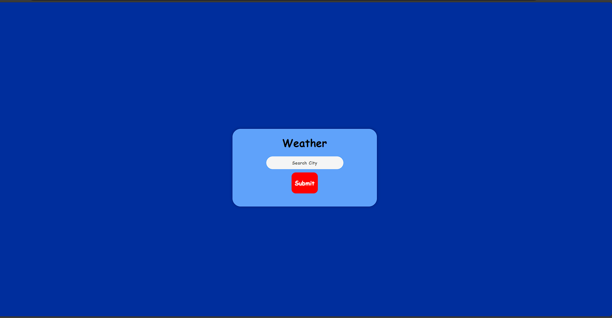
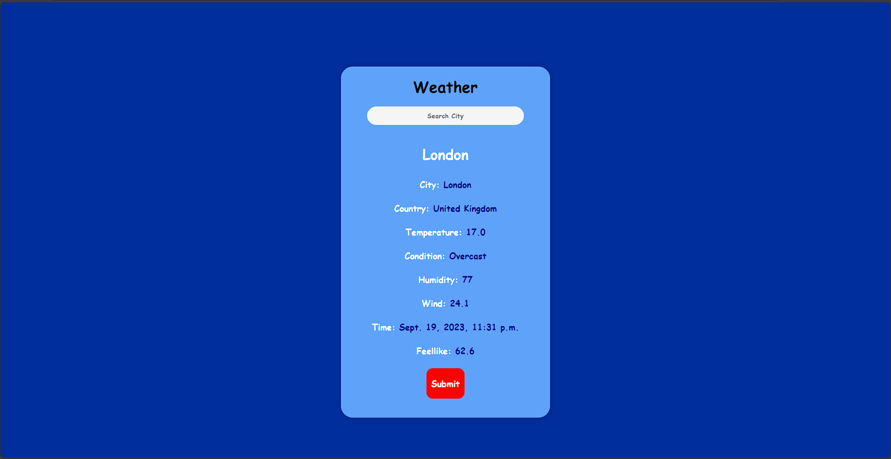

# Django Weather App

## Showcase
https://github.com/Ayanleaideed/Django-Weather-App/assets/116397906/29e661ba-d39d-473d-bc31-b7812c4261f3

## Description

The Django Weather App is a web application that provides current weather information for cities around the world. With this app, users can easily check the weather conditions in their desired locations.

## Features

- Enter a city name to get real-time weather data.
- View temperature, weather conditions, humidity, wind speed, and more.
- Responsive design for a seamless experience on desktop and mobile devices.

## Getting Started

To run this project locally, follow these steps:

1. Clone this repository.
2. Set up a virtual environment for your Django project.
3. Install project dependencies using `pip install -r requirements.txt`.
4. Obtain an API key from a weather data provider (e.g., WeatherAPI).
5. Create a `.env` file in the project root directory and add your API key:
"API_KEY=your_api_key_here"
6. Migrate the database with `python manage.py migrate`.
7. Start the Django development server with `python manage.py runserver`.
8. Access the app in your web browser at `http://localhost:8000`.

## Usage

1. Enter the name of a city in the input field.
2. Click the "Submit" button to fetch weather data.
3. View the current temperature, weather condition, humidity, wind speed, and time of last update.
4. Enjoy staying informed about the weather in your chosen locations.

## Showcase

## Contributions

Contributions to this project are welcome!

## License

This project is licensed under the MIT License. See the [LICENSE](LICENSE) file for details.

---

**Note:** For more details about the project code and configuration, refer to the relevant files in the project directory.
